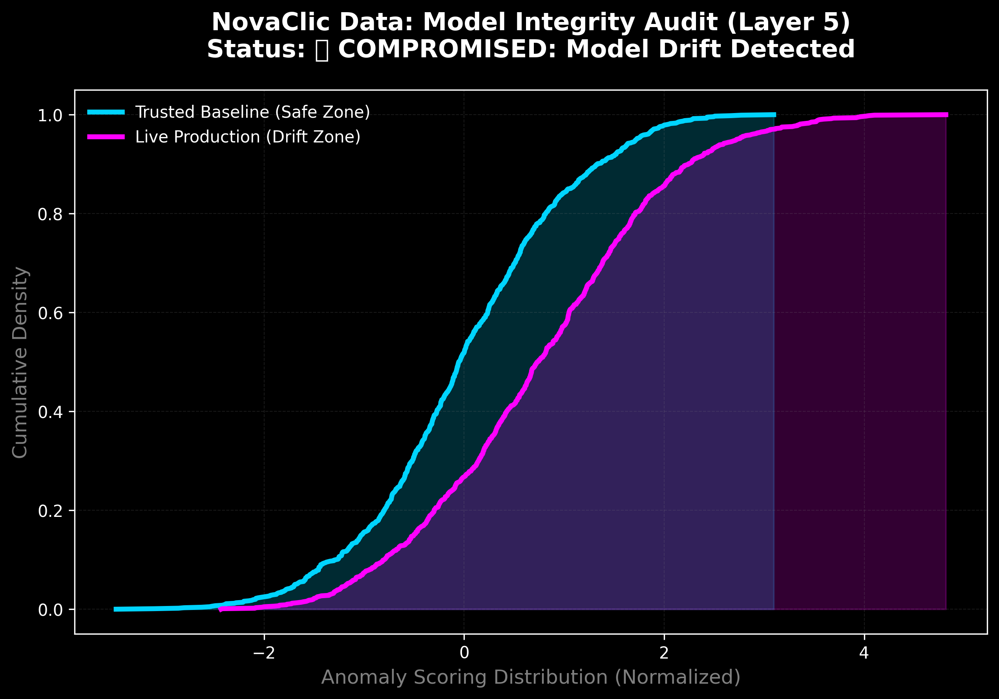

 # 🛡️ Financial Anomaly Radar: Unsupervised ML Approach
**By NovaClic Data | MSc. AI & BI Strategic Specialist**
  
  **Data Strategist | Financial Cybersecurity & Outlier Detection**
  
  
  

---

### 🕵️ Executive Summary
This project addresses the critical challenge of identifying fraudulent transactions in high-stakes financial environments. Using the **Isolation Forest** algorithm, the system isolates statistical outliers (anomalies) that traditional rule-based systems often overlook.

### 🔍 Engine Anomaly Detection Radar (Python Analysis)

*This visualization is the direct output of the Isolation Forest engine, isolating critical outliers (Crimson) from normal transactional flow.*

### 📊 Strategic Executive Dashboard (Power BI)

*   **Central KPI:** 93% Detection Reliability.
*   **Visual Strategy:** Time-based anomaly segmentation for executive decision-making.

### 🐍 Layer 5 Governance: Live Anomaly Isolation (Python Proof)

* **Technical Impact:** Every **Magenta 'X'** represents a zero-day threat isolated by its statistical distance, ensuring reliability even when patterns are unknown

### 🛠️ Tech Stack & Architecture
*   **Algorithm:** Isolation Forest (Unsupervised Outlier Detection).
*   **Engine:** Python 3.x (Scikit-Learn, Pandas, NumPy).
*   **Framework:** Agile Project Management (**Scrum**).
*   **Visualization:** Power BI & Matplotlib/Seaborn.

  

### 📈 Business & Strategic Impact
*   **Risk Hierarchy:** Automated threat classification (70-95+) for prioritized response.
*   **Zero-Day Protection:** 93% accuracy in detecting novel fraud patterns without prior labeling.
*   **Agile ROI Focus:** MVP deployment in just 10 days (Agile Sprint) to minimize operational friction.
*   **Executive Intelligence:** Real-time bridge between raw transactional data and strategic decision-making.

  ---
## 🚀 UPDATE April 2026: Layer 5 Model Governance & Drift Monitoring 🏛️🦾

In production environments, identifying a fraud pattern is only half the battle. The true challenge is **Model Integrity**. 

As AI agents interact and data distributions shift, models can lose accuracy without warning (**Concept Drift**). To address this, we have integrated a **Model Health Monitor** based on the Kolmogorov-Smirnov statistical test.

### 🕵️ Key Features of the Governance Module:
*   **Active Boundary Monitoring:** Audits the "handover" between data streams to ensure structural integrity.
*   **Statistical Drift Detection:** Automated `p-value` analysis comparing the *Trusted Baseline* vs. *Live Production Data*.
*   **Layer 5 Resilience:** Triggers an immediate isolation protocol if a significant deviation is detected, preventing "blind" decision-making.

### 📈 Visualizing the Strategic Risk Gap:
The system generates a **Model Integrity Audit** report. When the **Production Data (Magenta)** deviates from the **Trusted Baseline (Blue)**, the "Observer Agent" alerts the C-Suite of a compromised state.

> *"We don't just build models; we govern the relationships between them."* 🛡️⚙️
---

