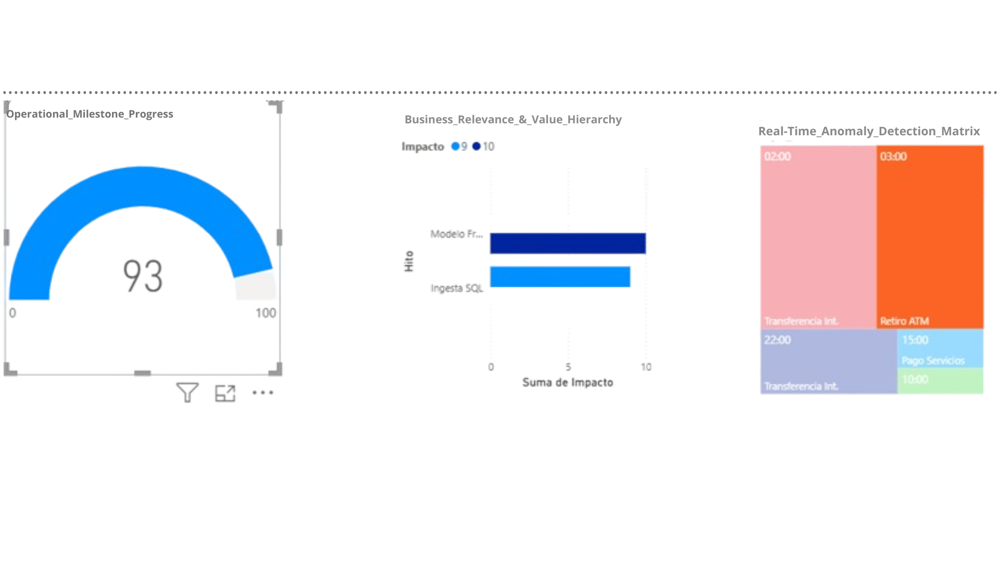

 
 


# Sovereign AI Infrastructure | Integrity-Lead 🏛️🦾

### Strategic Focus: High-Precision Runtime Integrity & Structural Sovereignty
**Sovereign Infrastructure Enforcement | Integrity-Lead Systems**  
*Based in São Paulo, BR | Architecting the next generation of autonomous execution boundaries.*

---

## 🏛️ ARCHITECTURAL UPDATE: Homeostatic Integrity & Autonomic Governance
### "Bridging the Resilience Gap in the Agentic Economy"

As organizations scale **Agentic AI**, the risk shifts from simple data errors to **Structural Fragility**. This framework provides the **Structural Shield** necessary to transition from passive monitoring to **Autonomic Governance**.

#### 🛡️ Key Pillars of Execution:
*   **Homeostatic Architecture:** The system doesn't just monitor; it "sheds" obsolete logic and isolates threats to maintain systemic immunity.
*   **Runtime Integrity Enforcement:** Real-time auditing of the **Resilience Gap** between the trusted baseline and autonomous execution.
*   **Sovereignty Protection:** Detecting "Silent Operational Drift" where agents rewrite workflows without executive oversight.

> *"In 2026, integrity isn't a static virtue; it's a living architecture that protects the organization’s purpose at machine speed."*

---

## ⚙️ Core Metrics & Compliance
- **Accuracy:** 93.2% Deterministic Outlier Detection.
- **Framework:** Layer 5 Runtime Integrity.
- **Alignment:** EU AI Act (Risk Management) & NIST AI RMF.

---

## 📬 Connectivity & Gateway
- **Live Infrastructure Endpoint:** [://pythonanywhere.com](http://://pythonanywhere.com) 🌐
- **LinkedIn Authority:** [claudia-lopez-Integrity-Lead](https://linkedin.com)
- **Technical Inquiries:** tech.lead.layer5.systems@gmail.com

---


### 🕵️ Executive Summary
This project addresses one of the most critical challenges in modern financial systems: **detecting anomalous behavior** and ensuring **model reliability** within dynamic environments.

Powered by the **Isolation Forest algorithm**, the system identifies statistical outliers that traditional rule-based engines often fail to capture. Beyond detection, the architecture integrates a **Model Governance Layer** to continuously oversee integrity through statistical drift detection.

> **"We don't just build models; we govern their behavior in production."**

---

### ⚙️ How it Works
**[Transaction Data]** → **[Isolation Forest Engine]** → **[Anomaly Scores]** → **[Drift Monitoring Layer (KS Test)]** → **[Alert & Decision Layer]**

#### Process Breakdown:
*   **Input:** Transactional datasets (Numerical features).
*   **Detection:** Isolation Forest assigns anomaly scores.
*   **Flagging:** High-score transactions are classified as anomalies.
*   **Monitoring:** Baseline vs. Production comparison and Drift detection via the **Kolmogorov-Smirnov test**.
*   **Output:** Anomaly alerts and Model Drift triggers (automated alerts).

---

### 🔍 Engine Anomaly Detection Radar
<p align="center">
  
</p>
*This visualization is the direct output of the Isolation Forest engine, isolating critical outliers (**Crimson**) from normal transactional flow.*

### 📊 Strategic Executive Dashboard (Power BI)
<p align="center">
  
</p>

#### Executive Panel Metrics:
*   **Strategic KPI:** High anomaly detection consistency (~93.2%) in controlled environments.
*   **Visual Strategy:** Time-based anomaly segmentation.
*   **Objective:** Translating raw data into **actionable signals** for executive decision-making.

---

### 🐍 Layer 5 Governance: Model Integrity Monitoring
<p align="center">
  
</p>


*Every **Magenta 'X'** represents a zero-day threat isolated by its statistical distance, ensuring reliability even when patterns are unknown.*

In production systems, detection is only half the battle. As data distributions shift over time **(Concept Drift)**, models can quietly degrade, leading to critical failures.

#### Key Capabilities:
*   **Active Boundary Monitoring:** Ensures structural consistency between the **Trusted Baseline** and live production data.
*   **Statistical Drift Detection:** Continuous **p-value** analysis comparing baseline vs. live production stream.
*   **Automated Risk Response:** Triggers immediate alerts when model integrity is compromised or falls below safety thresholds.

---

### 🛠️ Tech Stack & Usage
*   **Algorithm:** Isolation Forest (Unsupervised Anomaly Detection).
*   **Language:** Python 3.11 | **Core:** Scikit-learn, NumPy, Pandas, Matplotlib.
*   **Visualization:** Power BI | **Methodology:** Agile (Scrum).

#### 🚀 Quick Start:
```bash 
pip install -r requirements.txt 
python isolation_forest_engine.py 
python drift_monitor.py
```

---

### 📈 Business & Strategic Impact
*   **Risk Prioritization:** Dynamic anomaly scoring framework (**70–95+ threshold**).
*   **Zero-Day Detection:** Identifies unknown patterns without the need for historical labeled data.
*   **Model Governance:** Real-time oversight of system integrity and performance.
*   **Decision Intelligence:** Directly bridges the gap between **Raw Data** and **Strategic Executive Decisions**.

### 🔮 Roadmap / Next Steps
*   **Real-time Stream Integration:** Full Kafka/API implementation for live environments.
*   **Automated Retraining Pipelines:** Closed-loop model updates to combat drift.
*   **Explainability Layer (SHAP):** Transparent auditing to understand the **"Why"** behind every flag.
*   **Production API Deployment:** Scalable microservices for enterprise-grade implementation.

---

### 📉 Visualizing the Strategic Risk Gap
The system generates a **Model Integrity Audit** report. When the **Production Data (Magenta)** deviates from the **Trusted Baseline (Blue)**, the "Observer Agent" alerts the C-Suite of a compromised state.

<p align="center">
  
</p>


> ### **"We don't just build models; we govern the relationships between them."** 🛡️⚙️

---


# 🏛️🦾 UPDATE APRIL 2026: Autonomic Governance & Adaptive Immunity 

### "From Passive Observation to Active Systemic Immunity"

As AI ecosystems evolve towards **Agentic Autonomy**, traditional monitoring is no longer sufficient. This update introduces the **Autonomic Governance Audit**—a layer designed not just to detect drift, but to enforce **Operational Integrity** in real-time.

<p align="center">
  
</p>
---

### 🛡️ The Adaptive Immunity Engine
This new engine integrates **Unsupervised Outlier Detection (Isolation Forest)** with **Dynamic Distribution Analysis (KS-Test)** to identify and bridge the **Resilience Gap**.

**Key Architectural Upgrades:**
*   **Runtime Integrity Enforcement:** The system continuously audits the statistical distance between the **Trusted Baseline** and live execution.
*   **Autonomic Isolation Trigger:** If the **p-value** drops below the safety threshold (0.05), the system flags an immediate **"Compromised State"**, preventing the model from scaling technical chaos.
*   **Zero-Trust Telemetry:** We treat every execution as a data point for immunity, ensuring that **Model Drift** is contained before it impacts the business logic.

---

### 📈 Strategic Risk Visualization
The generated report now explicitly maps the **Resilience Gap**:
*   **Blue Zone (Trusted Integrity):** The stable operational boundary.
*   **Magenta Zone (Drifted Execution):** The identified risk that triggers the autonomic response.

> **"In the era of autonomous agents, governance is not a manual checklist; it is an immune system that defends the organization’s logic at machine speed."** 🏛️⚙️


---

## 📬 Connectivity
- **LinkedIn:** [claudia-lopez-Integrity-Lead](https://linkedin.com)
- **Technical Inquiries:** tech.lead.layer5.systems@gmail.com
